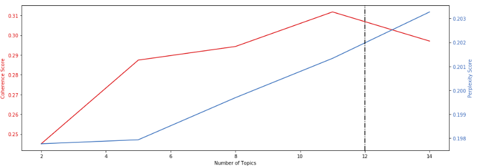
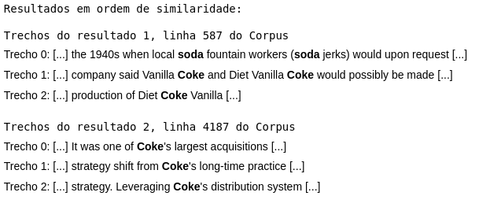

<h1>Sistemas de Recuperação de Informação</h1>

Curso de Sistema de Recuperação de Informação - Mestrado EMAp/FGV 2019

Para responder as listas e fazer o trabalho final, foi necessário a utilização de um Corpus específico escolhido pelo aluno.

Neste caso utilizou-se um Corpus composto pelas páginas da Wikipedia, totalizando um arquivo com um tamanho total de 3.2GB. Entretanto para facilitar o raciocínio e também as respostas das listas optou-se pela utilização de um Corpus reduzido.

Foram utilizadas algumas técnicas conhecidas para analisar a relação entre os textos disponibilizados pelo Corpus escolhido. Entre elas estão o <b>word2vec</b> e o <b>Tf-idf</b>. Além disso também foi realizado a construção de uma função de busca baseado no <b>whoosh</b>.

Uma interpretação da aplicação das técnicas citadas acima: Para o TF-IDF, a função abaixo retorna o "peso" que cada palavra do dicionário construído a partir de cada texto do Corpus (palavras únicas) possui para aquele texto. Já para o LSI e LDA temos que é retornado para cada texto do Corpus um vetor que fornece o quanto cada tema está relacionado com aquele texto. Além disso podemos verificar também como cada tema é construído, isto é, quais palavras do dicionário construído anteriormente para elaborar o TF-IDF são as mais importantes para aquele tema. 

O gráfico das pontuações de perplexidade e coerência sobre o Corpus da Wiki podem ser visualizados abaixo:

O mecanismo de busca conseguia retornar os trechos parecidos com a sentença objetivo dentre todos os textos do corpus e utilizava uma mpetrica de similaridade capaz de ranquear as melhores respostas. Um exemplo pode ser visto na imagem abaixo:

<h3>Link do Corpus</h3>

Segue o link de onde foi possível baixar o Corpus para realização do Projeto Final 2019.

<a href="https://blog.lateral.io/2015/06/the-unknown-perils-of-mining-wikipedia/">https://blog.lateral.io/2015/06/the-unknown-perils-of-mining-wikipedia/</a>

